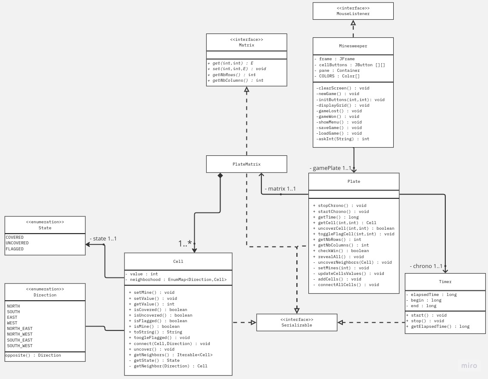

# Rapport : Projet Démineur 
Chevalier Antoine et Lenglet Léa | 15 avril 2023

## I - Introduction au sujet

Le jeu Démineur a été créé en 1989 par Robert Donner, qui travaillait pour Microsoft à l'époque. Le démineur est un jeu de logique où le joueur doit découvrir chaque case du plateau en évitant les mines cachées. La grille est divisée en cases carrées et le joueur peut cliquer sur chaque case pour révéler son contenu. Si la case révélée contient une mine, le jeu se termine. Si la case ne contient pas de mine, elle révèle un chiffre qui indique le nombre de mines adjacentes à cette case.

## II - Conception
Afin d'implémenter une solution stable du Démineur nous avons fait appel à un système comprenant 3 interfaces, 5 classes et 2 énumérations illustré par l'UML ci-dessous.

Dans un premier temps, nous avons implémenter la classe `Cell` qui nous permet de stocker à la fois : 
- La valeur de la cellule 
  - `-1` si la cellule est une mine
  - `{0-8}` si la cellule est vide ce qui représente le nombre de mine adjacentes à la case
- Son état qui est défini par une des valeurs de l'énumération `State`
- Ses voisins sont stockés sous forme de couple (Direction,cellule) dans une `EnumMap`.

Afin de stocker toutes les cellules dans une grille nous avons fais le choix de créer une interface `Matrix` qui permet de manipuler les structures de données de type matrice. Nous avons implémenté la classe `PlateMatrix` à partir de cette interface en utilisant des listes imbriquées de type `ArrayList`.

Pour créer la grille de jeu, nous avons implémenter une classe `Plate` qui a comme attribut : 
- `gamePlate` qui est une instance de PlateMatrix
- un chronomètre qui est une instance de l'objet `Timer` qui nous permet de stocker la durée de résolution d'une grille.

Pour finir, nous avons traiter la partie bonus de l'énoncé en implémentant une interface graphique qui est gérée dans la classe `Minesweeper`. Nous avons décidé de remplacer complètement notre TUI par soucis d'uniformité entre les différents machines utilisées.

## III - Implémentation 
Dans cette partie nous allons vous expliquer les particularités de notre implémentation du jeu.

Au démarage du jeu, le joueur peut soit : 
- Générer une nouvelle grille à partir des différents paramètres demandés en appelant `newGame()`
- Charger une partie d'un fichier .ser avec `load()`

Après cela nous initialisons la grille. Pour ce faire, nous utilisons les fonctions `addCells()` qui nous permet de créer toutes les cellules. Ensuite, le programme exécute `connectAllCells()` qui permet de créer la relation entre toutes les cellules de la grille comme précisé dans le sujet. Enfin, le programme ajoute les mines dans la grille avec `setMines(int)` puis met à jour chaque valeur dans les cases vides avec `updateCellsValues()`.
En parallèle, nous créons un tableau de `JButton` qui va nous permettre d'interagir avec les cellules dans l'interface graphique.

Le programme principal entre alors dans une boucle qui affichera la grille avec la fonction `DisplayGrid()`. 
- Si le joueur appuie sur un bouton de la grille cela enclenche la fonction `uncover()` liée à la cellule cliquée.
La fonction `uncover()` modifie le statut de la cellule en `UNCOVERED`. Si cette cellule a une valeur égale à 0, on fait un appel récursif de la fonction sur toutes les cellules voisines.
- Si le joueur appuie sur un bouton avec le clic droit, cela déclanchera la fonction `toggleFlagged()` qui changera le statut de la cellule en `FLAGGED`.
- Si le joueur appuie sur le bouton de sauvegarde la fenêtre ouvre une fenêtre de dialogue ou le joueur peut entré un nom de fichier. 
Le jeu regardera enfin si une mine a été découverte :
- Si oui, `gameLost()` est exécuté 
- Si non, le programme regarde si la grille remplie les conditions de victoire et exécute `gameWon()`

Si aucune des conditions ci-dessus sont respectées la boucle continue son exécution.

### 1 - Gestion des sauvegardes
Le système de sauvegarde de notre démineur se repose sur l'interface `Serializable` de Java.
L'interface Serializable en Java permet de sérialiser un objet, c'est-à-dire de le convertir en une séquence d'octets qui peut être stockée dans un fichier .ser comme dans notre cas.
On peut ensuite le désérialiser pour le restaurer à son état d'origine. Cela va nous permettre de sauvegarder notre grille de jeu `gamePlate` dans un fichier afin de pouvoir reprendre sa partie plus tard en chargeant le fichier au menu principal.
Pour que l'ensemble des données de la grille soit sérialisées, nous avons dû implémenter `Serializable` avec toutes nos classes dont dépend `Plate`. 

### 2 - Gestion des intéractions avec l'utilisateur
Notre classe `Minesweeper` implémente l'interface `MouseListener` afin de pourvoir gérer les différentes entrées provenant de la souris.
Cette implémentation s'est avérée nécessaire pour permettre à l'utilisateur de pouvoir marquer une case de la grille. 

Nous avons également utilisé des `ActionListener` pour pouvoir attribuer une suite d'instructions à la suite d'un clic sur un bouton.

Enfin, nous avons utilisé pricipalement le système de fenêtre "pop-up" : 
- Pour demander les dimensions de la grille ou même le fichier dans lequel écrire la sauvegarde.
- Pour afficher les erreurs survenus
- Pour afficher le résultats d'une partie

### 3 - Particularités
Nous avons utilisé le principe des Enhanced Switch dans nos fonctions `toString()` et `toggleFlagged()`. Cet méthode permet d'écrire du code plus propre et plus concis, car elle permet d'éviter l'utilisation de multiples clauses if-else imbriquées. Nous avons également fait l'utilisation d'un `yield` et d'une expression ternaire pour définir la méthode d'affichage d'une cellule révélée.

Nous avons décidé de rajouter la fonctionnalité du chronomètre pour être plus fidèle à la version originale du jeu. 

